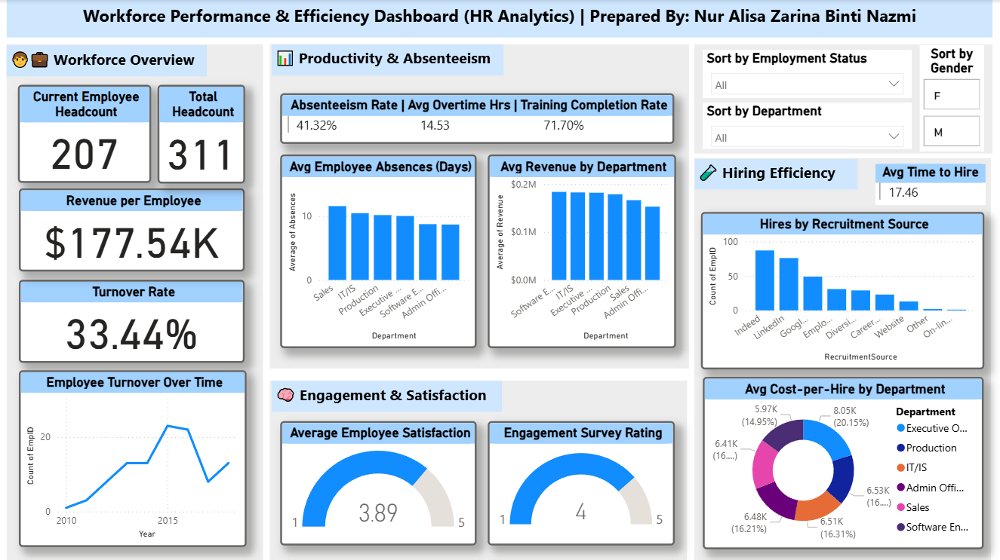

# 🧑‍💼 Workforce Performance & Efficiency Dashboard
### HR Analytics | Power BI



> <!-- PICK ONE AND DELETE THE REST:
> Option A: HR analytics dashboard tracking workforce turnover, hiring efficiency, and employee engagement across departments — built with Power BI and DAX.
> Option B: End-to-end HR analytics project covering data cleaning, DAX modelling, and interactive dashboard development in Power BI.
> Option C: Exploring what drives employee turnover and hiring costs — an HR analytics dashboard built from a cleaned Kaggle dataset using Power BI.
> -->

---

## 📌 Overview

This is an end-to-end HR analytics project — from raw data cleaning in Python to exploratory analysis and interactive dashboard development in Power BI. It provides HR stakeholders with a centralised view of key workforce metrics, enabling data-driven decisions around talent management, hiring efficiency, and employee engagement.

The dataset used is **HRDataset_v14** — an open source HR analytics dataset from Kaggle (`cleaned_hr_data.csv`).

---

## 🔄 Project Workflow

```
Raw CSV (Kaggle)  →  Python Cleaning (Google Colab)  →  EDA  →  Power BI Dashboard
```

---

## 🧹 Data Cleaning (Python — Google Colab)

Cleaned the raw `HRDataset_v14.csv` using **pandas** before loading into Power BI. Steps included:

| Step | Detail |
|---|---|
| **Missing values** | `DateofTermination` nulls retained (indicates active employees); `ManagerID` nulls filled with `-1` placeholder |
| **Date parsing** | Converted `DOB`, `DateofHire`, `DateofTermination`, `LastPerformanceReview_Date` to datetime |
| **Logical date checks** | Flagged future DOBs, future hire dates, termination dates before hire date |
| **Consistency checks** | Validated `MaritalStatusID` vs `MaritalDesc`, `GenderID` vs `Sex`, `PerfScoreID` vs `PerformanceScore` |
| **Categorical cleaning** | Stripped whitespace from `Sex`, capitalised `HispanicLatino`, corrected performance score mismatches |
| **Feature engineering** | Created `TermCategory` column — categorised `TermReason` into `Voluntary`, `Involuntary`, `Still Employed` |
| **Export** | Saved cleaned output as `cleaned_hr_data.csv` |

---

## 🔍 EDA Key Findings (Python)

- Salary distribution is right-skewed — most employees fall in lower-to-mid salary ranges
- Employees with higher performance scores (`Exceeds`, `Exceptional`) tend to have higher median salaries
- Positive correlation found between `EngagementSurvey` and `EmpSatisfaction` scores
- Among terminated employees, **voluntary exits** (another position, more money, career change) outnumber involuntary ones
- **Indeed** and **LinkedIn** are the dominant recruitment sources

---

## 📊 Dashboard Sections

| Section | Key Metrics |
|---|---|
| **Workforce Overview** | Current & Total Headcount, Revenue per Employee, Turnover Rate |
| **Productivity & Absenteeism** | Absenteeism Rate, Avg Overtime Hours, Training Completion Rate, Avg Absences by Dept |
| **Engagement & Satisfaction** | Avg Employee Satisfaction Score, Engagement Survey Rating |
| **Hiring Efficiency** | Avg Time to Hire, Hires by Recruitment Source, Avg Cost-per-Hire by Dept |

---

## 💡 Dashboard Key Insights

- **33.44% turnover rate** signals a retention challenge worth investigating at department level
- **Software Engineering** and **IT/IS** departments show the highest average revenue per employee
- **Indeed and LinkedIn** are the top recruitment sources by volume
- **Executive Operations** has the highest cost-per-hire at ~$8.05K (20.15% of total)
- Average employee satisfaction sits at **3.89 / 5** — room for engagement improvement

---

## 🛠️ Tools & Technologies


- **Python (Google Colab)** — data cleaning, EDA, and feature engineering using `pandas`, `matplotlib`, `seaborn`
- **Power BI Desktop** — data modelling and report development
- **DAX** — custom measures for headcount, turnover rate, hiring efficiency metrics

---

## 📐 DAX Measures (Selected)

```dax
-- Active Employee Headcount (returns 0 instead of blank when filtered)
Headcount = 
COALESCE(
    CALCULATE(
        COUNTROWS('cleaned_hr_data'),
        ISBLANK('cleaned_hr_data'[DateofTermination])
    ),
    0
)

-- Turnover Rate
Turnover Rate = 
DIVIDE(
    CALCULATE(COUNTROWS('cleaned_hr_data'), NOT ISBLANK('cleaned_hr_data'[DateofTermination])),
    COUNTROWS('cleaned_hr_data')
)
```

---

## 🗂️ Repository Structure

```
📁 workforce-performance-dashboard/
├── 📄 README.md
├── 📓 Workforce_Performance_HR_Analytics.ipynb   ← Python cleaning & EDA notebook
├── 📊 HR_Analytics.pbix                          ← Power BI report file
├── 📄 HR_Analytics.pdf                           ← Static PDF export
└── 📁 screenshots/
    └── HR_Analytics_Screenshot1.png              ← Shows default (main) dashboard
    └── HR_Analytics_Screenshot2F.png             ← Dashboard view filtered by gender (female)
    └── HR_Analytics_Screenshot2FV.png            ← Dashboard view filtered by gender (female) and employment status (terminated for cause)
    └── HR_Analytics_Screenshot3AP_showall.png    ← Dashboard view filtered by gender (male) and department (production)

```

---

## 🚀 How to Use

1. Open `Workforce_Performance_HR_Analytics.ipynb` in Google Colab to explore the cleaning and EDA steps
2. Download `HR_Analytics.pbix` and open with **Power BI Desktop** (free at microsoft.com/powerbi)
3. Explore the report using the slicers — **Employment Status**, **Gender**, **Department** — to filter views

---

## 👩‍💻 Author

**Nur Alisa Zarina Binti Nazmi**  
Data & Analytics Specialist | BI Developer  
[](https://linkedin.com/in/your-linkedin-url)
[](https://github.com/your-github-username)

---

*Built as part of a personal analytics portfolio showcasing end-to-end BI development skills.*
